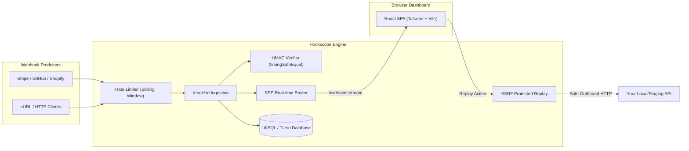

# Hookscope ⚡

<div align="center">

[](LICENSE)
[](package.json)
[](https://fastify.dev)
[](https://react.dev)
[](https://tailwindcss.com)
[](https://vitest.dev)
[](https://www.typescriptlang.org)

**Real-Time Webhook Inspector & Debugger for Modern Developers.**  
Capture, inspect, verify HMAC signatures, simulate custom responses, and replay HTTP requests in real-time.

[Fitur Utama](#-fitur-utama) • [Arsitektur](#-arsitektur) • [Cara Jalan Lokal](#-cara-jalan-lokal) • [Panduan Deploy Render & Turso](#-panduan-deploy-gratis-render--turso) • [Dokumentasi API](#-dokumentasi-api)

</div>

---

## 🎯 Gambaran Umum

Hookscope adalah perkakas pengembang (*developer tool*) untuk menangkap, menginspeksi, dan menguji webhook HTTP secara *real-time* tanpa perlu membuat server publik atau menggunakan tunneling rumit. Setiap endpoint dilengkapi dengan ID unik dan masa berlaku (*TTL*), menyiarkan request masuk secara instan via Server-Sent Events (SSE), memverifikasi tanda tangan kriptografi (HMAC), serta memungkinkan pengujian ulang (*replay*) dengan proteksi SSRF yang tangguh.

---

## ✨ Fitur Utama

- ⚡ **Real-Time Live Streaming (SSE)** — Webhook yang masuk langsung muncul di dashboard seketika tanpa refresh halaman via Server-Sent Events dengan auto-reconnect & heartbeat.
- 🔐 **Verifikasi HMAC Timing-Safe** — Validasi integritas payload otomatis menggunakan algoritma **SHA-256** atau **SHA-1** dengan proteksi *constant-time comparison* (`crypto.timingSafeEqual`) untuk menangkal serangan *side-channel timing attack*.
- 🎛️ **Simulasi Custom Response** — Konfigurasikan status code (100–599), custom JSON/text response body (hingga 100 KB), MIME Content-Type, dan simulasi delay buatan (0–10.000 ms) untuk menguji penanganan error / timeout pada producer webhook.
- 🔁 **Replay Request Aman dengan Proteksi SSRF** — Kirim ulang payload webhook yang telah tercatat ke server tujuan Anda. Dilengkapi proteksi SSRF komprehensif: resolusi DNS asinkron, pemblokiran rentang IP privat/loopback/cloud metadata (`169.254.169.254`), verifikasi redirect manual (*anti-redirect bypass*), dan pembersihan *hop-by-hop headers*.
- 📋 **cURL Generator Siap Pakai** — Buat perintah `curl` yang dapat direproduksi langsung dari dashboard dengan satu klik.
- 🛡️ **Pertahanan Berlapis (Defense-in-Depth)** — Rate limiting in-memory sliding window (60 req/menit per endpoint, 10 pembuatan endpoint/jam per IP), batasan payload 1 MB, pembersihan otomatis data kedaluwarsa (TTL) setiap 10 menit, serta pencegahan XSS ketat.
- 🎨 **Antarmuka Pengguna Modern & Aksesibel** — Dibangun dengan standar **WCAG 2.1 AA**, mendukung mode Gelap (*Dark*) dan Terang (*Light*), navigasi keyboard penuh (W3C ARIA tablist), dan tata letak responsif (360px mobile hingga desktop).

---

## 🏗️ Arsitektur



Detail teknis lengkap tersedia di [`docs/ARCHITECTURE.md`](docs/ARCHITECTURE.md) dan log keputusan arsitektur di [`docs/DECISIONS.md`](docs/DECISIONS.md).

---

## 🚀 Cara Jalan Lokal

### Prasyarat

- **Node.js**: versi 20.0.0 atau lebih baru
- **npm**: versi 10.0.0 atau lebih baru

### 1. Kloning & Install Dependensi

```bash
git clone https://github.com/khanifnaufal/hookscope.git
cd hookscope
npm install
```

### 2. Konfigurasi Lingkungan (.env)

Salin template variabel lingkungan:

```bash
cp .env.example .env
```

Isi default pada `.env` sudah siap digunakan untuk pengembangan lokal dengan SQLite database lokal:

```env
PORT=3000
NODE_ENV=development
BASE_URL=http://localhost:3000
DATABASE_URL=file:./data/local.db
TURSO_AUTH_TOKEN=
ALLOWED_ORIGINS=http://localhost:5173,http://localhost:3000
```

### 3. Menjalankan Server & Web Frontend

Jalankan backend Fastify dan frontend Vite secara bersamaan:

```bash
# Terminal 1: Backend Fastify (Port 3000)
npm run dev:server

# Terminal 2: Frontend Vite React (Port 5173)
npm run dev:web
```

Buka peramban Anda di: `http://localhost:5173`

---

## 🧪 Menjalankan Test & Linting

Hookscope dilengkapi **109 unit & integration tests** yang mencakup seluruh lapisan sistem:

```bash
# Menjalankan seluruh test suite (server + web)
npm run test

# Menjalankan linter kode (ESLint)
npm run lint

# Menjalankan build produksi
npm run build
```

---

## 🌐 Panduan Deploy Gratis (Render + Turso)

Hookscope dirancang monolitik dan efisien sehingga dapat di-deploy 100% gratis menggunakan kombinasi **Turso (Database)** dan **Render (Web Service)**.

### Langkah 1: Buat Database di Turso (Gratis)

1. Buat akun di [Turso.tech](https://turso.tech).
2. Buat database baru bernama `hookscope`:
   ```bash
   turso db create hookscope
   ```
3. Dapatkan database URL dan token autentikasi:
   ```bash
   turso db show hookscope --url
   # Contoh output: libsql://hookscope-youruser.turso.io

   turso db tokens create hookscope
   # Contoh output: eyJhbGciOi... (JWT token)
   ```

### Langkah 2: Deploy ke Render (Web Service Gratis)

1. Buat akun di [Render.com](https://render.com) dan pilih **New Web Service**.
2. Hubungkan repositori GitHub `hookscope` Anda.
3. Masukkan konfigurasi berikut:
   - **Name**: `hookscope`
   - **Region**: Singapore / Frankfurt / Oregon (bebas)
   - **Environment**: `Node`
   - **Branch**: `main`
   - **Build Command**: `npm run build`
   - **Start Command**: `npm start`
   - **Instance Type**: `Free`
4. Tambahkan **Environment Variables**:
   | Key | Value Contoh | Deskripsi |
   |---|---|---|
   | `NODE_ENV` | `production` | Mengaktifkan logging terstruktur & optimasi |
   | `PORT` | `3000` | Port aplikasi |
   | `BASE_URL` | `https://hookscope.onrender.com` | URL publik web service Anda |
   | `DATABASE_URL` | `libsql://hookscope-youruser.turso.io` | URL database Turso Anda |
   | `TURSO_AUTH_TOKEN` | `eyJhbGciOi...` | Token database Turso Anda |
   | `ALLOWED_ORIGINS` | `https://hookscope.onrender.com` | Origin CORS yang diizinkan |

5. Klik **Create Web Service**. Render akan secara otomatis menjalankan migrasi skema tabel dan menyajikan aplikasi monolitik (API + Web Dashboard)!

> 💡 **Catatan Penanganan Cold Start (Render Free Tier):**  
> Pada tier gratis Render, web service akan tidur (*spin-down*) jika tidak ada traffic selama 15 menit. Hookscope menyediakan endpoint health check `GET /health` yang merespon seketika (`{"status":"ok"}`). Anda dapat menggunakan layanan gratis seperti *UptimeRobot* atau *Cron-job.org* yang melakukan ping ke `https://hookscope.onrender.com/health` setiap 10 menit untuk menjaga service tetap terjaga.

---

## 🧪 Contoh Pengujian dengan Webhook Nyata (Sandbox)

### A. Uji Coba dengan Stripe CLI
```bash
# 1. Login ke Stripe CLI
stripe login

# 2. Forward webhook ke URL Hookscope Anda
stripe listen --forward-to https://<your-host>/hook/<your-endpoint-id>

# 3. Trigger event contoh
stripe trigger payment_intent.succeeded
```

### B. Uji Coba Cepat dengan cURL
```bash
curl -X POST https://<your-host>/hook/<your-endpoint-id> \
  -H "Content-Type: application/json" \
  -H "X-Hub-Signature-256: sha256=abcdef1234567890..." \
  -d '{"event":"user.registered","user_id":"usr_9981","email":"dev@example.com"}'
```

---

## 📚 Dokumentasi API

| Endpoint | Method | Autentikasi | Deskripsi |
|---|---|---|---|
| `POST /api/endpoints` | `POST` | Publik (Rate limited: 10/hr) | Membuat endpoint webhook baru |
| `GET /api/endpoints/:id` | `GET` | `Bearer <manage_token>` | Mengambil metadata dan pengaturan endpoint |
| `PATCH /api/endpoints/:id` | `PATCH` | `Bearer <manage_token>` | Mengubah konfigurasi respons kustom dan HMAC |
| `DELETE /api/endpoints/:id` | `DELETE` | `Bearer <manage_token>` | Menghapus endpoint beserta seluruh request-nya |
| `GET /api/endpoints/:id/requests` | `GET` | `Bearer <manage_token>` | Mengambil daftar request (mendukung search & filter method) |
| `DELETE /api/endpoints/:id/requests/:rid` | `DELETE` | `Bearer <manage_token>` | Menghapus satu request tertentu |
| `DELETE /api/endpoints/:id/requests` | `DELETE` | `Bearer <manage_token>` | Menghapus seluruh request pada endpoint |
| `GET /api/endpoints/:id/stream` | `GET` | `Bearer <manage_token>` | Server-Sent Events (SSE) stream real-time |
| `POST /api/endpoints/:id/requests/:rid/replay` | `POST` | `Bearer <manage_token>` | Replay request ke target URL dengan proteksi SSRF |
| `/hook/:id` | `ALL` | Publik | Penangkap webhook (menerima semua HTTP method) |
| `GET /health` | `GET` | Publik | Liveness / health check endpoint |

---

## 📄 Lisensi

Hak Cipta © 2026. Proyek ini dilisensikan di bawah [MIT License](LICENSE).
