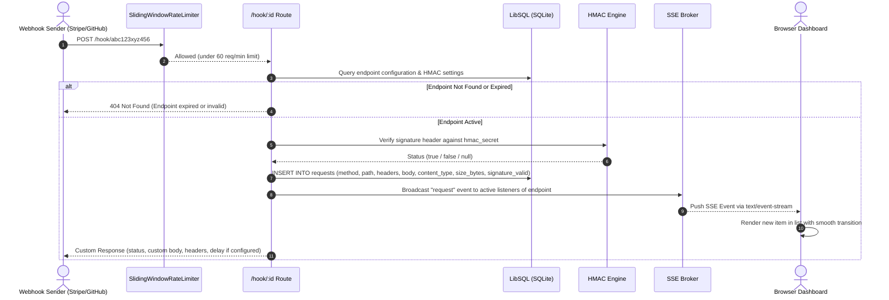

# Hookscope — Technical Architecture & Design Specification

Dokumentasi arsitektur komprehensif untuk sistem **Hookscope**: *High-Performance, Real-Time Webhook Inspector & Debugger*.

---

## 1. Ringkasan Sistem (High-Level Overview)

Hookscope adalah platform inspeksi dan penangkapan webhook *real-time* yang dirancang untuk pengembang (*developer tool*). Sistem ini menyediakan endpoint HTTP unik sementara (*ephemeral*) untuk menangkap segala bentuk webhook masuk, memvalidasi integritas tanda tangan kriptografi (HMAC), menyiarkan payload seketika ke antarmuka web melalui Server-Sent Events (SSE), serta memungkinkan pengujian ulang (*replay*) ke server tujuan dengan proteksi keamanan Server-Side Request Forgery (SSRF) tingkat lanjut.

```mermaid
graph TD
    subgraph Webhook Producers
        Stripe[Stripe / GitHub / Shopify / Midtrans]
        Curl[cURL / HTTP Clients]
    end

    subgraph Hookscope Ingestion & Server (Fastify + Node.js)
        HookRoute["/hook/:id (Public Ingestion)"]
        RateLimiter["In-Memory Sliding Window Rate Limiter"]
        HMACService["HMAC Verification Engine (timingSafeEqual)"]
        DB[(LibSQL / SQLite Database)]
        SSEBroker["SSE Stream Manager (Broadcast Engine)"]
        APIRoutes["/api/* (Protected API Routes with CORS)"]
        SSRFEngine["SSRF Protection & Replay Engine"]
        StaticServer["@fastify/static (React Single Page App)"]
        CleanupJob["TTL Background Cleanup (Every 10 min)"]
    end

    subgraph Browser Frontend (React + Vite + Tailwind)
        UI[Dashboard & Inspector UI]
        SSEClient[EventSource SSE Connection]
    end

    subgraph Replay Targets
        ExternalAPI[External Public Server / Webhook Consumer]
    end

    Stripe -->|POST Webhook| RateLimiter
    Curl -->|HTTP Request| RateLimiter
    RateLimiter --> HookRoute
    HookRoute --> HMACService
    HookRoute --> DB
    HookRoute -->|Broadcast Event| SSEBroker
    SSEBroker -->|Real-time SSE Push| SSEClient
    SSEClient --> UI
    UI -->|Manage / Query / Custom Config| APIRoutes
    APIRoutes --> DB
    UI -->|Replay Request| SSRFEngine
    SSRFEngine -->|Validated Safe Outbound HTTP| ExternalAPI
    StaticServer -->|Serve Assets| UI
    CleanupJob -.->|Purge Expired Data| DB
```

---

## 2. Struktur Monorepo

Sistem disusun menggunakan arsitektur monorepo berbasis NPM Workspaces:

```
hookscope/
├── package.json               # Root workspaces configuration & build scripts
├── .env.example               # Template environment variables
├── CHANGELOG.md               # Log perubahan versi (Conventional Commits)
├── AGENT_BRIEF.md             # Spesifikasi teknis dan tahapan fase
├── docs/
│   ├── ARCHITECTURE.md        # Arsitektur sistem (dokumen ini)
│   ├── DECISIONS.md           # Decision Log (ADR)
│   └── DESIGN.md              # Design system tokens & aesthetic principles
├── server/                    # Backend (Node.js + Fastify + TypeScript)
│   ├── package.json
│   ├── tsconfig.json
│   ├── vitest.config.ts
│   ├── src/
│   │   ├── index.ts           # Entry point & server bootstrapper
│   │   ├── app.ts             # Fastify factory, CORS, static serving & error handler
│   │   ├── config.ts          # Environment variables parsing & validation
│   │   ├── db/
│   │   │   ├── client.ts      # LibSQL/Turso database client
│   │   │   └── schema.sql     # SQLite schema definitions & indexes
│   │   ├── routes/
│   │   │   ├── endpoints.ts   # Endpoint CRUD & custom response config
│   │   │   ├── hook.ts        # Webhook capture pipeline
│   │   │   ├── requests.ts    # Request query, filter & delete endpoints
│   │   │   ├── stream.ts      # Server-Sent Events (SSE) streaming
│   │   │   └── replay.ts      # Request replay route with SSRF protection
│   │   └── services/
│   │       ├── auth.ts        # Bearer manage_token validation
│   │       ├── cleanup.ts     # Periodic TTL cleaner (10-minute interval)
│   │       ├── hmac.ts        # Constant-time HMAC signature verification
│   │       ├── rateLimit.ts   # In-memory sliding-window rate limiters
│   │       ├── sse.ts         # SSE event broker & client connection registry
│   │       └── ssrf.ts        # Async DNS resolution & private IP blocklist
│   └── test/                  # Test suites (Vitest)
│       ├── app.test.ts
│       ├── endpoints.test.ts
│       ├── hardening.test.ts
│       ├── hmac.test.ts
│       ├── hook.test.ts
│       ├── replay.test.ts
│       ├── requests.test.ts
│       └── stream.test.ts
└── web/                       # Frontend (React 18 + TypeScript + Vite + Tailwind CSS)
    ├── package.json
    ├── vite.config.ts
    ├── src/
    │   ├── main.tsx           # React bootstrap & theme initialization
    │   ├── App.tsx            # Main application layout, routing & state container
    │   ├── components/        # Accessible UI Components
    │   │   ├── CopyButton.tsx     # Copy-to-clipboard with visual feedback
    │   │   ├── Countdown.tsx      # Endpoint expiration countdown timer
    │   │   ├── EmptyState.tsx     # Rich interactive instructions & sample curls
    │   │   ├── MethodBadge.tsx    # Accessible HTTP method badges (color + text)
    │   │   ├── ReplayModal.tsx    # Replay modal with SSRF response inspector
    │   │   ├── RequestDetail.tsx  # Multi-tab detail panel (Body/Headers/Query/Signature)
    │   │   ├── RequestList.tsx    # Live request list with ARIA live region
    │   │   ├── SettingsModal.tsx  # Endpoint config & HMAC settings dialog
    │   │   ├── Toast.tsx          # Real-time notification banners
    │   │   └── ...
    │   └── lib/               # Utility modules
    │       ├── api.ts         # HTTP client wrapper & token storage
    │       ├── curl.ts        # Reproducible cURL command generator
    │       ├── format.ts      # Human-readable byte formatting & relative time
    │       └── sse.ts         # Resilient EventSource wrapper with auto-reconnect
    └── test/                  # Frontend unit tests (Vitest)
        ├── curl.test.ts
        └── detail.test.ts
```

---

## 3. Pipeline Pemrosesan Webhook (Ingestion Pipeline)

Ketika sebuah webhook dikirimkan ke `http(s)://<host>/hook/:id`:



### Karakteristik Teknis Ingestion:
1. **Raw Body Retention**: Body mentah disimpan apa adanya (termasuk string JSON, form URL-encoded, text/plain, dan biner yang dikonversi ke Base64). Hal ini krusial agar verifikasi HMAC tidak rusak oleh serialisasi ulang JSON.
2. **Normalisasi Header**: Header duplikat (misal beberapa cookie) digabungkan menjadi string tunggal yang dipisahkan tanda koma (`, `), memastikan integritas struktur `Record<string, string>`.
3. **Konfigurasi Respons Kustom**: Pengguna dapat mengonfigurasi status respons (100–599), body kustom hingga 100 KB, Content-Type, dan jeda waktu buatan (*delay simulation*) hingga 10.000 ms.

---

## 4. Basis Data dan Skema Data

Hookscope menggunakan **LibSQL** (kompatibel penuh dengan SQLite), mendukung file lokal untuk lingkungan dev (`file:./data/local.db` atau in-memory `:memory:` untuk pengujian) dan Turso Cloud Database (`libsql://...`) untuk lingkungan production.

```sql
-- Tabel Endpoint Webhook
CREATE TABLE IF NOT EXISTS endpoints (
  id TEXT PRIMARY KEY,                       -- ID acak 12 karakter (nanoid)
  manage_token TEXT NOT NULL,                -- Token administrasi 32 karakter
  response_status INTEGER DEFAULT 200,       -- Status code HTTP respons kustom
  response_body TEXT DEFAULT '{"ok":true}',  -- Body respons kustom
  response_content_type TEXT DEFAULT 'application/json',
  response_delay_ms INTEGER DEFAULT 0,       -- Delay buatan (0 - 10000 ms)
  hmac_secret TEXT,                          -- Kunci rahasia HMAC (opsional)
  hmac_algo TEXT,                            -- Algoritma: 'sha256' | 'sha1'
  hmac_header TEXT,                          -- Nama header signature kustom
  created_at TEXT NOT NULL DEFAULT (datetime('now')),
  expires_at TEXT NOT NULL                   -- Waktu kedaluwarsa (default: 24 jam)
);

-- Tabel Request Webhook
CREATE TABLE IF NOT EXISTS requests (
  id INTEGER PRIMARY KEY AUTOINCREMENT,
  endpoint_id TEXT NOT NULL REFERENCES endpoints(id) ON DELETE CASCADE,
  method TEXT NOT NULL,                      -- GET, POST, PUT, DELETE, dll
  path TEXT NOT NULL,                        -- Subpath request (e.g. /users/created)
  query TEXT,                                -- Parameter query string dalam format JSON
  headers TEXT NOT NULL,                     -- Header request dalam format JSON
  body TEXT,                                 -- Raw body atau base64 payload
  content_type TEXT,                         -- MIME type request
  ip TEXT,                                   -- Alamat IP pengirim
  size_bytes INTEGER NOT NULL,               -- Ukuran muatan payload dalam bytes
  signature_valid INTEGER,                   -- 1 = Valid, 0 = Invalid, NULL = Tidak ada header
  received_at TEXT NOT NULL DEFAULT (datetime('now'))
);

-- Indeks Performa
CREATE INDEX IF NOT EXISTS idx_requests_endpoint_id ON requests(endpoint_id);
CREATE INDEX IF NOT EXISTS idx_requests_received_at ON requests(endpoint_id, received_at DESC);
CREATE INDEX IF NOT EXISTS idx_endpoints_expires_at ON endpoints(expires_at);
```

---

## 5. Keamanan & Hardening (Defense-in-Depth)

Hookscope mengimplementasikan prinsip keamanan berlapis:

### A. Proteksi SSRF (Server-Side Request Forgery) pada Fitur Replay
1. **Validasi Protokol**: Hanya mengizinkan skema `http:` dan `https:`. Skema berisiko seperti `file:`, `ftp:`, `gopher:`, atau `dict:` ditolak seketika.
2. **Resolusi DNS Asinkron**: Hostname target di-resolve ke seluruh daftar alamat IPv4 (`dns.resolve4`) dan IPv6 (`dns.resolve6`). Jika ada alamat IP target yang termasuk dalam daftar berikut, request ditolak dengan kode `422`:
   - **Loopback**: `127.0.0.0/8`, `::1`
   - **Private LAN RFC 1918**: `10.0.0.0/8`, `172.16.0.0/12`, `192.168.0.0/16`
   - **Link-Local & Cloud Metadata**: `169.254.0.0/16` (AWS/GCP/Azure IMDS), `fe80::/10`
   - **Unique Local IPv6**: `fc00::/7`
   - **Unspecified**: `0.0.0.0/8`, `::`
3. **Manual Redirect Inspection**: Pustaka `fetch` dikonfigurasi dengan `redirect: 'manual'`. Setiap hop redirect diperiksa ulang alamat IP tujuannya sebelum diikuti (maksimal 5 hop) untuk mencegah serangan *redirect-based SSRF bypass*.
4. **Pembatasan Response Body & Timeout**: Output response target dibatasi maksimal 1 MB dan waktu eksekusi dibatasi 5 detik menggunakan `AbortController` untuk mencegah kehabisan memori atau thread locking.
5. **Pembersihan Hop-by-Hop Headers**: Header seperti `host`, `connection`, `transfer-encoding`, `keep-alive`, `upgrade` dihilangkan saat request diteruskan.

### B. Verifikasi HMAC Bebas Serangan Timing (Timing-Attack Safe)
Perbandingan hash signature dilakukan menggunakan fungsi `crypto.timingSafeEqual`. Jika panjang buffer berbeda, operasi perbandingan dummy konstan waktu tetap dieksekusi untuk mencegah kebocoran informasi melalui *side-channel timing analysis*.

### C. Rate Limiting (Sliding Window In-Memory)
- **Ingestion**: 60 request/menit per ID endpoint (mengembalikan `429 Too Many Requests` dengan header `Retry-After: 60`, `X-RateLimit-Limit`, `X-RateLimit-Remaining`).
- **Endpoint Creation**: 10 pembuatan endpoint/jam per alamat IP klien (mencegah spam pendaftaran endpoint liar).

### D. CORS & Logging
- Rute manajemen `/api/*` dibatasi dengan CORS hanya untuk origin terdaftar (`ALLOWED_ORIGINS` atau default dev).
- Fastify Logger diatur dalam format JSON terstruktur untuk lingkungan produksi (memudahkan agregasi log Datadog / Logtail / Grafana Loki) dan `pino-pretty` untuk lingkungan pengembangan.

---

## 6. Real-Time Streaming (Server-Sent Events)

Hookscope memilih **Server-Sent Events (SSE)** dibanding WebSocket karena:
- Berjalan di atas protokol HTTP/1.1 dan HTTP/2 standar tanpa overhead handshake bidirectional.
- Dukungan *native auto-reconnect* dari antarmuka `EventSource` di browser.
- Dukungan `Last-Event-ID` untuk memulihkan event yang terputus tanpa duplikasi.
- Pembersihan channel otomatis ketika koneksi browser tertutup (`req.raw.on('close')`).
- Heartbeat ping setiap 15 detik (`: ping\n\n`) untuk menjaga koneksi tetap aktif melewati reverse proxy (Render / NGINX / Cloudflare).

---

## 7. Strategi Deployment Monolitik (Dockerless)

Hookscope dapat dideploy secara instan pada platform seperti **Render (Free Tier)**, **Fly.io**, **Railway**, atau VPS:

1. **Fastify Static Serving**: Server Fastify bertindak sebagai monolit yang menyajikan API, Webhook Ingestion, SSE Stream, sekaligus file statis React (`web/dist`).
2. **SPA Fallback Routing**: Seluruh URL navigasi browser yang bukan berawalan `/api` atau `/hook` diarahkan ke `web/dist/index.html`.
3. **Database Turso**: Menggunakan koneksi database `libsql://` tanpa memerlukan instance server database lokal di container.
4. **Pembersihan Otomatis TTL**: Job internal berjalan setiap 10 menit untuk menghapus endpoint dan rekaman webhook yang telah kedaluwarsa.
